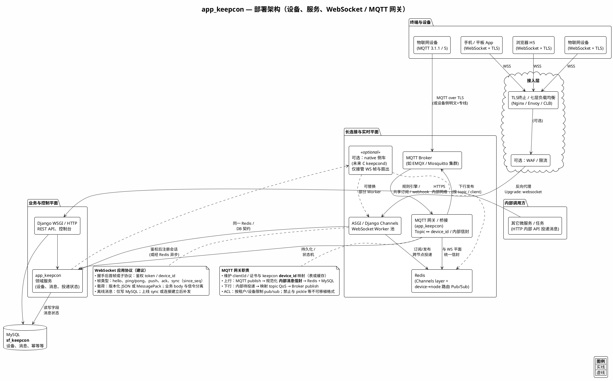
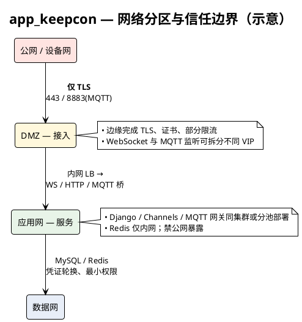
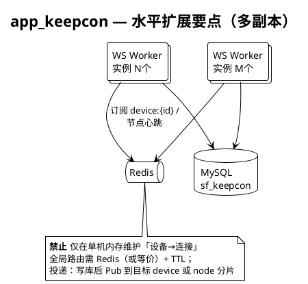

# app_keepcon 部署架构（PlantUML）

**分阶段**：**首阶段仅 WebSocket 路径**（终端 → TLS 接入 → Channels Worker → Redis → MySQL）。图中 **MQTT Broker与网关为第二阶段**，与 WS 共用 Redis 信封与 `sf_keepcon`；实现首版时可忽略 MQTT 节点或视为规划态。

下文为 PlantUML 源码。可：

- 复制到独立文件 `deployment_architecture.puml` 后用 [PlantUML](https://plantuml.com/) CLI / IDE 插件渲染；
- 或在本仓库用支持 `plantuml` 代码块的预览插件直接渲染本文件。

---

## 主图：设备、服务、WebSocket与 MQTT 网关

---

## 网络分区与信任边界

---

## 水平扩展要点

